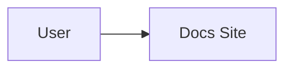

# VitePress Mermaid Rendering

Use this reference when a VitePress docs site contains Mermaid diagrams or the preview shows raw `mermaid` code blocks.

## Reference Pattern

1. Add dependencies:

```bash
npm install -D mermaid vitepress-mermaid-renderer
```

2. Keep Markdown diagrams as normal fenced blocks:

````markdown

````

3. Initialize the renderer from `docs/.vitepress/theme/index.js` or `index.ts`:

```js
import { h, nextTick, watch } from 'vue'
import DefaultTheme from 'vitepress/theme'
import { useData } from 'vitepress'
import { createMermaidRenderer } from 'vitepress-mermaid-renderer'
import './style.css'

let mermaidRenderer = null

export default {
  extends: DefaultTheme,
  Layout: () => {
    const { isDark } = useData()

    const initMermaid = () => {
      const theme = isDark.value ? 'dark' : 'forest'

      if (mermaidRenderer?.setConfig) {
        mermaidRenderer.setConfig({ theme })
        return
      }

      mermaidRenderer = createMermaidRenderer({
        theme,
        startOnLoad: false,
        flowchart: {
          useMaxWidth: true,
          htmlLabels: true,
        },
        downloadFormat: 'svg',
        desktop: {
          zoomIn: 'enabled',
          zoomOut: 'enabled',
          resetView: 'enabled',
          copyCode: 'enabled',
          download: 'disabled',
          positions: { vertical: 'top', horizontal: 'right' },
        },
        mobile: {
          zoomIn: 'disabled',
          zoomOut: 'disabled',
          resetView: 'enabled',
          toggleFullscreen: 'enabled',
        },
      })
    }

    nextTick(initMermaid)
    watch(() => isDark.value, () => nextTick(initMermaid), { immediate: true })

    return h(DefaultTheme.Layout)
  },
}
```

4. Add responsive Mermaid styles in `docs/.vitepress/theme/style.css`:

```css
.mermaid {
  width: 100%;
  overflow-x: auto;
  overflow-y: hidden;
  padding: 1.5rem 0.5rem;
  margin: 1rem 0;
  position: relative;
  scrollbar-gutter: stable;
}

.mermaid svg {
  display: block;
  width: 100%;
  height: auto;
  max-width: 100%;
  transform-origin: center center;
}
```

5. Verify:

```bash
npm run docs:build
npm run docs:preview
```

Open a page with Mermaid. The visible output should be an SVG/rendered diagram with controls, not a syntax-highlighted `mermaid` code block.

## Avoid

- Do not hand-roll a Markdown fence renderer unless the plugin cannot satisfy the project constraints.
- Do not scan DOM text and call Mermaid manually if a site renderer package can own the lifecycle.
- Do not accept local preview until route changes, theme changes, and at least one diagram page have been checked.
